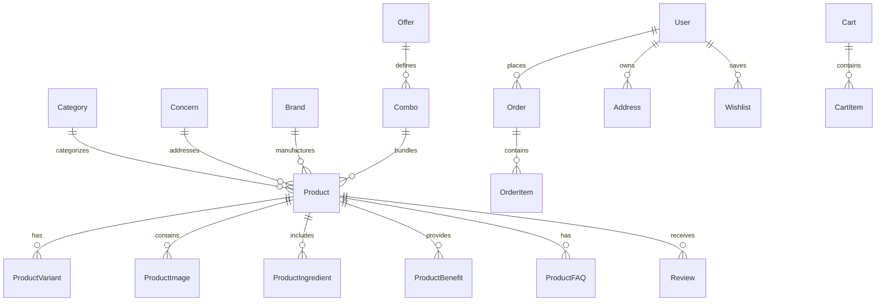

# FIBAX PHARMA — DATABASE SCHEMA & DATA MODEL SPECIFICATION
## PostgreSQL + Prisma ORM Relational Architecture

---

### 1. Architectural Overview
The database is built on **PostgreSQL** managed via **Prisma ORM**, providing strict relational integrity, ACID transactions for order management, robust indexing for product search, and flexible JSONB storage for dynamic attributes.

---

### 2. Entity Relationship Overview


---

### 3. Complete Prisma Schema Definition

```prisma
datasource db {
  provider = "postgresql"
  url      = env("DATABASE_URL")
}

generator client {
  provider = "prisma-client-js"
}

enum Role {
  CUSTOMER
  ADMIN
  STAFF
}

enum OrderStatus {
  PENDING
  CONFIRMED
  PROCESSING
  SHIPPED
  OUT_FOR_DELIVERY
  DELIVERED
  CANCELLED
  REFUNDED
}

enum PaymentStatus {
  PENDING
  AUTHORIZED
  PAID
  FAILED
  REFUNDED
}

enum PaymentMethod {
  RAZORPAY_UPI
  RAZORPAY_CARDS
  RAZORPAY_NETBANKING
  CASH_ON_DELIVERY
}

enum DosageForm {
  SYRUP
  CAPSULE
  TABLET
  JUICE
  POWDER
  OIL
  SOAP
  FACEWASH
  COMBO_KIT
}

model User {
  id           String     @id @default(uuid())
  email        String?    @unique
  phone        String     @unique
  firstName    String?
  lastName     String?
  passwordHash String?
  role         Role       @default(CUSTOMER)
  createdAt    DateTime   @default(now())
  updatedAt    DateTime   @updatedAt

  addresses    Address[]
  orders       Order[]
  reviews      Review[]
  wishlists    Wishlist[]
  cart         Cart?
}

model Address {
  id           String   @id @default(uuid())
  userId       String
  fullName     String
  phone        String
  addressLine1 String
  addressLine2 String?
  landmark     String?
  city         String
  state        String
  pincode      String
  isDefault    Boolean  @default(false)
  createdAt    DateTime @default(now())

  user         User     @relation(fields: [userId], references: [id], onDelete: Cascade)
  orders       Order[]
}

model Brand {
  id          String    @id @default(uuid())
  name        String    @unique // e.g. "Fibax Ayurveda", "Axe Ortho", "Stonupchar"
  slug        String    @unique
  logoUrl     String?
  description String?
  products    Product[]
}

model Category {
  id          String      @id @default(uuid())
  name        String      @unique // e.g. "Syrups", "Capsules", "Juices"
  slug        String      @unique
  description String?
  imageUrl    String?
  dosageForm  DosageForm
  products    Product[]
}

model Concern {
  id          String    @id @default(uuid())
  name        String    @unique // e.g. "Joint & Pain Relief", "Digestive Health"
  slug        String    @unique
  iconUrl     String?
  bannerUrl   String?
  description String?
  metaTitle   String?
  metaDesc    String?
  products    Product[]
}

model Product {
  id             String    @id @default(uuid())
  title          String
  slug           String    @unique
  shortDesc      String
  fullDesc       String    @db.Text
  dosageForm     DosageForm
  mrp            Decimal   @db.Decimal(10, 2)
  salePrice      Decimal   @db.Decimal(10, 2)
  discountPercent Int      @default(0)
  sku            String    @unique
  stockQuantity  Int       @default(100)
  inStock        Boolean   @default(true)
  isFeatured     Boolean   @default(false)
  isBestseller   Boolean   @default(false)
  volumeWeight   String    // e.g. "200ml", "30 Capsules", "100gm"
  ayushLicense   String?   // AYUSH manufacturing license number
  ratingAverage  Decimal   @default(4.8) @db.Decimal(3, 2)
  ratingCount    Int       @default(0)
  
  brandId        String
  categoryId     String
  concernId      String

  brand          Brand     @relation(fields: [brandId], references: [id])
  category       Category  @relation(fields: [categoryId], references: [id])
  concern        Concern   @relation(fields: [concernId], references: [id])

  variants       ProductVariant[]
  images         ProductImage[]
  ingredients    ProductIngredient[]
  benefits       ProductBenefit[]
  faqs           ProductFAQ[]
  reviews        Review[]
  orderItems     OrderItem[]
  cartItems      CartItem[]
  wishlistItems  Wishlist[]

  createdAt      DateTime  @default(now())
  updatedAt      DateTime  @updatedAt

  @@index([slug])
  @@index([concernId])
  @@index([categoryId])
}

model ProductVariant {
  id            String   @id @default(uuid())
  productId     String
  packName      String   // e.g. "Pack of 1", "Pack of 2 (Save 10%)", "3-Month Course"
  packQuantity  Int      @default(1)
  mrp           Decimal  @db.Decimal(10, 2)
  salePrice     Decimal  @db.Decimal(10, 2)
  stockQuantity Int      @default(50)
  sku           String   @unique

  product       Product  @relation(fields: [productId], references: [id], onDelete: Cascade)
}

model ProductImage {
  id        String   @id @default(uuid())
  productId String
  url       String
  altText   String?
  sortOrder Int      @default(0)
  isPrimary Boolean  @default(false)

  product   Product  @relation(fields: [productId], references: [id], onDelete: Cascade)
}

model Ingredient {
  id          String   @id @default(uuid())
  name        String   @unique // e.g. "Ashwagandha", "Shilajit", "Triphala", "Nirgundi"
  botanical   String?  // e.g. "Withania Somnifera"
  description String?
  imageUrl    String?

  products    ProductIngredient[]
}

model ProductIngredient {
  id           String     @id @default(uuid())
  productId    String
  ingredientId String
  potency      String?    // e.g. "500mg extract", "Standardized to 5% withanolides"

  product      Product    @relation(fields: [productId], references: [id], onDelete: Cascade)
  ingredient   Ingredient @relation(fields: [ingredientId], references: [id])

  @@unique([productId, ingredientId])
}

model ProductBenefit {
  id        String   @id @default(uuid())
  productId String
  title     String   // e.g. "Promotes Rapid Cartilage Flexibility"
  description String?
  icon      String?  // Lucide icon identifier

  product   Product  @relation(fields: [productId], references: [id], onDelete: Cascade)
}

model ProductFAQ {
  id        String   @id @default(uuid())
  productId String
  question  String
  answer    String   @db.Text
  sortOrder Int      @default(0)

  product   Product  @relation(fields: [productId], references: [id], onDelete: Cascade)
}

model Review {
  id          String   @id @default(uuid())
  productId   String
  userId      String?
  authorName  String
  rating      Int      @default(5)
  title       String?
  content     String   @db.Text
  isVerified  Boolean  @default(true)
  status      String   @default("APPROVED") // PENDING, APPROVED, REJECTED
  helpfulCount Int     @default(0)
  createdAt   DateTime @default(now())

  product     Product  @relation(fields: [productId], references: [id], onDelete: Cascade)
  user        User?    @relation(fields: [userId], references: [id])
}

model Cart {
  id        String     @id @default(uuid())
  userId    String?    @unique
  sessionId String?    @unique
  items     CartItem[]
  updatedAt DateTime   @updatedAt
  user      User?      @relation(fields: [userId], references: [id], onDelete: Cascade)
}

model CartItem {
  id        String   @id @default(uuid())
  cartId    String
  productId String
  quantity  Int      @default(1)
  cart      Cart     @relation(fields: [cartId], references: [id], onDelete: Cascade)
  product   Product  @relation(fields: [productId], references: [id])
}

model Order {
  id              String        @id @default(uuid())
  orderNumber     String        @unique // e.g. "FBX-2026-1049"
  userId          String?
  customerName    String
  customerPhone   String
  customerEmail   String?
  addressId       String?
  shippingAddress Json          // Snapshot of full address
  orderStatus     OrderStatus   @default(PENDING)
  paymentStatus   PaymentStatus @default(PENDING)
  paymentMethod   PaymentMethod
  paymentGatewayId String?      // Razorpay Payment ID or Order ID
  subtotal        Decimal       @db.Decimal(10, 2)
  shippingCost    Decimal       @default(0) @db.Decimal(10, 2)
  discountTotal   Decimal       @default(0) @db.Decimal(10, 2)
  grandTotal      Decimal       @db.Decimal(10, 2)
  trackingNumber  String?
  courierPartner  String?       // e.g. Delhivery, Bluedart
  notes           String?
  createdAt       DateTime      @default(now())
  updatedAt       DateTime      @updatedAt

  user            User?         @relation(fields: [userId], references: [id])
  address         Address?      @relation(fields: [addressId], references: [id])
  items           OrderItem[]
}

model OrderItem {
  id        String   @id @default(uuid())
  orderId   String
  productId String
  title     String
  unitPrice Decimal  @db.Decimal(10, 2)
  quantity  Int      @default(1)
  total     Decimal  @db.Decimal(10, 2)

  order     Order    @relation(fields: [orderId], references: [id], onDelete: Cascade)
  product   Product  @relation(fields: [productId], references: [id])
}

model Coupon {
  id            String    @id @default(uuid())
  code          String    @unique // e.g. "WELCOME10", "AYUSH50"
  discountType  String    // PERCENTAGE or FIXED_AMOUNT
  discountValue Decimal   @db.Decimal(10, 2)
  minOrderValue Decimal   @default(0) @db.Decimal(10, 2)
  maxDiscount   Decimal?  @db.Decimal(10, 2)
  startDate     DateTime  @default(now())
  expiryDate    DateTime?
  usageLimit    Int?
  usageCount    Int       @default(0)
  isActive      Boolean   @default(true)
}

model Wishlist {
  id        String   @id @default(uuid())
  userId    String
  productId String
  createdAt DateTime @default(now())

  user      User     @relation(fields: [userId], references: [id], onDelete: Cascade)
  product   Product  @relation(fields: [productId], references: [id], onDelete: Cascade)

  @@unique([userId, productId])
}
```
