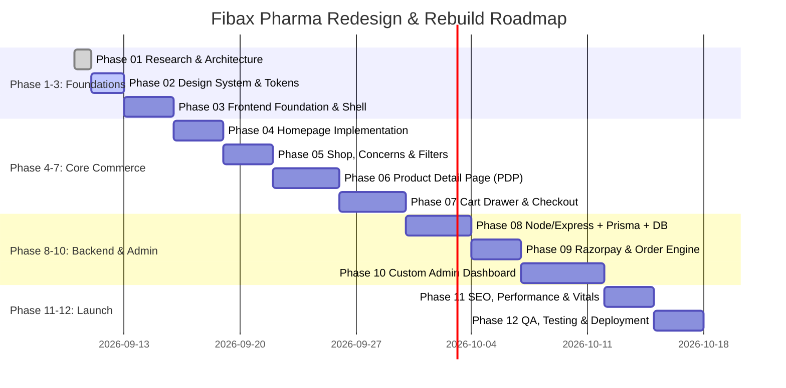

# FIBAX PHARMA — 12-PHASE DEVELOPMENT ROADMAP
## Engineering Milestones, Phased Execution & Quality Assurance

---

### 1. Roadmap Overview & Timeline

---

### 2. Phase-by-Phase Task Breakdown & Acceptance Criteria

#### Phase 01: Research, Audit & Complete Architecture [COMPLETED]
- Comprehensive audit of `fibaxpharma.com` and `krishnaayurved.com`.
- Complete catalog extraction of all 35 products.
- Authoring of 13 planning and architectural specifications.
- **Output**: Complete `/docs/` directory blueprints.

#### Phase 02: Design System & Tokens
- Setup Tailwind CSS v3/v4 with custom botanical tokens (`forest`, `sage`, `amber`, `cream`).
- Typography pairing with Google Fonts (Plus Jakarta Sans + Playfair Display).
- UI primitive component library setup (shadcn/ui Button, Badge, Dialog, Accordion, Sheet).
- **Acceptance Criteria**: Storybook / UI showcase validating all buttons, badges, inputs, and typography.

#### Phase 03: Frontend Foundation & Shell
- Vite + React 18 + TypeScript strict setup.
- Global Header with Sticky behavior, Top Announcement Bar, and Concern Dropdown.
- Responsive Mobile Navigation with touch-friendly drawer.
- Universal Footer with Trust Badges, Legal Links, and Social Handles.
- **Acceptance Criteria**: Responsive navigation passes WCAG accessibility and works seamlessly on 360px to 1920px viewports.

#### Phase 04: Sales-First Homepage
- Hero Slider with high-converting Ayurvedic value propositions.
- "Shop by Health Concern" visual grid (10 concerns).
- Bestsellers Carousel with quick-add cards.
- Featured Combos & Course Packs section.
- "Why Choose Fibax" clinical & botanical trust matrix.
- Customer Reviews & Ratings Marquee.
- **Acceptance Criteria**: Homepage achieves >90 mobile Lighthouse score and renders in <1.2s.

#### Phase 05: Shop, Categories & Filtering Engine
- Dynamic filtering by Health Concern, Formulation Type, Price Range, and Availability.
- Fast client-side and server-side sorting (Popularity, Price Low/High, Rating).
- Scalable pagination / infinite scroll for the product catalog.
- **Acceptance Criteria**: Filter updates execute instantaneously without page reloads.

#### Phase 06: Product Detail Page (PDP)
- Multi-image zoom gallery with thumbnail switcher.
- Dynamic Pack Size selector (1 Pack, 2-Pack with 10% discount, 3-Month Course).
- Sticky Bottom Bar on mobile with Price & dual CTAs ("Add to Cart" + "Buy Now").
- Structured Accordion for Ingredients, Benefits, How-To-Use, and FAQs.
- Verified customer reviews with rating stars and submission modal.
- **Acceptance Criteria**: Zero layout shift (CLS < 0.05); clear AYUSH disclaimer present.

#### Phase 07: Cart Drawer & Checkout Funnel
- Slide-over Cart Drawer with animated Free Shipping meter (₹999 threshold).
- In-cart 1-click upsell recommendations.
- 3-step streamlined checkout form (Phone OTP -> Shipping Address -> Payment).
- Coupon code engine supporting percentage and flat discounts.
- **Acceptance Criteria**: Cart updates immediately without page reflows; drawer opens smoothly on all devices.

#### Phase 08: Backend, Database & REST API
- Node.js + Express.js + TypeScript setup with Helmet, CORS, and Rate Limiting.
- PostgreSQL database provisioned with complete Prisma schema (25+ entities).
- Seed script to populate all 35 Fibax products, 10 concerns, and categories.
- CRUD REST API endpoints for products, concerns, cart, and reviews.
- **Acceptance Criteria**: API responses under 100ms with strict TypeScript payload validation via Zod.

#### Phase 09: Razorpay Payment & Order Engine
- Secure Razorpay payment gateway integration (UPI Intent, Cards, Netbanking).
- Webhook listener for payment verification and status synchronization.
- Cash on Delivery (COD) engine with OTP verification and ₹49 fee rules.
- Automated email and WhatsApp order confirmation triggers.
- **Acceptance Criteria**: 100% test coverage for payment verification and edge cases (dropouts, refunds).

#### Phase 10: Custom Admin Dashboard
- Analytics dashboard: Gross Revenue, Order Volume, AOV, Bestselling Products, Low Stock alerts.
- Product Catalog Manager: Add/Edit products, images, stock quantities, and prices.
- Order Management: View orders, update statuses (Processing, Shipped, Delivered), enter tracking IDs.
- Review Moderation: Approve or reject incoming customer reviews.
- Coupon & Banner Manager: Create promotional vouchers and adjust homepage hero slides.
- **Acceptance Criteria**: Protected by Admin JWT with RBAC security.

#### Phase 11: Technical SEO & Performance Hardening
- Automatic generation of XML sitemaps (`/sitemap.xml`) and `robots.txt`.
- Dynamic injection of Schema.org JSON-LD (Product, BreadcrumbList, FAQPage, Organization).
- WebP/AVIF image optimization with lazy loading.
- Pre-rendering / Edge caching setup for sub-second page loads.
- **Acceptance Criteria**: 95+ Performance, 100 SEO, 100 Accessibility on Google Lighthouse.

#### Phase 12: End-to-End QA, Staging & Production Deployment
- Cross-browser testing (Chrome, Safari iOS, Firefox, Edge, Android WebView).
- End-to-end purchasing test covering UPI and COD order flows.
- 301 URL redirect mapping from old WordPress URLs to new routes.
- Production deployment on edge hosting with continuous SSL and automated backups.
- **Acceptance Criteria**: Zero broken links, zero console errors, 100% successful transactional email/SMS delivery.
