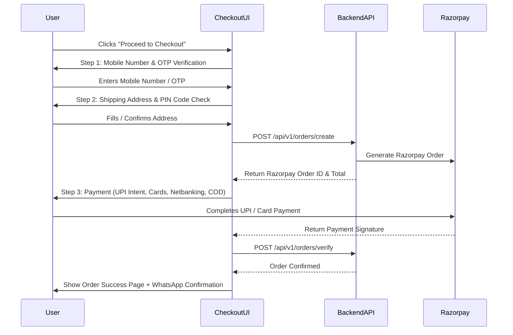

# FIBAX PHARMA — E-COMMERCE & CONVERSION GROWTH STRATEGY
## Revenue Optimization, Combos, Cart Drawer & Checkout Architecture

---

### 1. Revenue Drivers & Average Order Value (AOV) Multipliers
Currently, Fibax suffers from low transaction frequency and single-item cart drop-offs. The new e-commerce architecture targets a minimum AOV of **₹750 - ₹1,200** via strategic mechanisms:

#### A. Synergistic Multi-Product Bundles (Combos & Kits)
Ayurvedic therapies operate best when internal systemic support is paired with external topical application:

| Combo Kit Name | Formulations Bundled | Combined MRP | Bundle Offer | Strategic Intent |
| :--- | :--- | :--- | :--- | :--- |
| **Complete Joint & Arthritis Relief Kit** | Axe Ortho Oil (₹140) + Axe Ortho Capsules (₹380) + Axe Ortho Syrup (₹210) | ₹730 | **₹599** (Save 18%) | Complete 3-way internal & external pain relief therapy |
| **Ultimate Liver Detox & Digestive Cleanse** | Livupchar Syrup (₹229) + Livupchar Capsules (₹255) + Triphala Juice (₹260) | ₹744 | **₹619** (Save 17%) | Holistic gut and hepatic enzyme purification |
| **Diabetic Wellness & Metabolism Care Pack** | Diabdic Syrup (₹290) + Diabdic Capsules (₹399) + Neem Karela Jamun Juice (₹260) | ₹949 | **₹799** (Save 16%) | Synergistic glycemic balance kit |
| **Pure Immunity & Vitality Trio** | Multivitamin Syrup (₹345) + Amla Powder (₹230) + Ashwagandha Powder (₹230) | ₹805 | **₹669** (Save 17%) | Daily immune defense for working adults |
| **Kidney Stone & Urinary Flush Duo** | Stonupchar Syrup (₹269) + Stonupchar Capsules (₹225) + Uriupchar (₹300) | ₹794 | **₹649** (Save 18%) | Uric acid balance and renal flushing |

#### B. Volume-Tiered Pricing ("Buy More, Save More")
On individual product PDPs:
- **Buy 1 Bottle**: Regular Sale Price (e.g. ₹330)
- **Buy 2 Bottles (60-Day Course)**: 10% Extra Off (₹594 total / ₹297 each)
- **Buy 3 Bottles (90-Day Complete Course)**: 15% Extra Off + Free Shipping (₹841 total / ₹280 each)

---

### 2. High-Converting Cart Drawer (Slide-Over UX)
The cart drawer is the primary conversion hub when a customer adds an item:
1. **Dynamic Free Shipping Meter**:
   - Header: *"Add ₹240 more to get FREE Delivery!"* with animated green progress bar up to ₹499.
2. **Instant Quantity Adjustment**:
   - Inline `+` / `-` counters that recalculate totals via optimistic UI updates.
3. **Smart In-Cart Cross-Sells**:
   - 1-click Add buttons for complementary low-cost add-ons (e.g., Amla Powder ₹230, Rose Soap ₹90, Tus Remove Cough Syrup ₹120).
4. **Transparent Savings Breakdown**:
   - Displays Subtotal, Discount Applied (e.g. `WELCOME10 -₹50`), and Free Shipping eligibility.
5. **Direct 1-Click Checkout CTA**:
   - High-contrast green button: **"Proceed to Checkout (₹699)"**.

---

### 3. Conversion-Optimized 3-Step Checkout Flow

---

### 4. Cash on Delivery (COD) Optimization & RTO Reduction
Return-to-Origin (RTO) is the largest cost driver for Indian D2C health brands. To protect margins:
1. **COD Fee**: Add a nominal ₹49 convenience fee on COD orders, with a clear prompt: *"Pay Online via UPI & Save ₹49 (Instant FREE Shipping)"*.
2. **Phone Number OTP Validation**: Required for all COD orders to verify buyer authenticity before dispatch.
3. **Automated WhatsApp Order Confirmation**: Triggers an interactive WhatsApp button: *"Click to Confirm Your Fibax Pharma Order"* before packaging.

---

### 5. Conversion Features Prioritization Matrix (Item 22)

To avoid feature bloat and preserve sub-second site speed, features are prioritized into three distinct tiers:

#### Tier 1: HIGH PRIORITY (Core Launch Essentials - Direct Revenue Impact)
- **Sticky Add to Cart & Buy Now**: Fixed mobile bar appearing upon scrolling past the PDP buy box; ensures continuous conversion opportunity.
- **Instant "Buy Now" Direct Checkout**: 1-click bypass straight to checkout for single-item high-intent mobile shoppers.
- **Free Shipping Progress Tracker**: Dynamic real-time meter in Cart Drawer pushing shoppers above ₹499.
- **Frequently Bought Together Bundles**: Cross-sell widget on PDP offering 1-click bundle discount (e.g. Capsules + Oil).
- **Verified Purchase Customer Reviews**: Star ratings, buyer name, verification badge, and review count filters.
- **Trust & Purity Badges**: Clear AYUSH, GMP, 100% Herbal, and Pan-India Delivery seals on header, PDP, and checkout.
- **Live Search with Autocomplete & Concern Suggestions**: Fast debounced search suggesting products and health concerns.
- **WhatsApp Support Button**: Floating discreet WhatsApp assistance widget connecting hesitant buyers directly to health advisors.

#### Tier 2: MEDIUM PRIORITY (Phase 1 Post-Launch Optimization)
- **Quick View Modal**: Allows browsing and adding items directly from category/concern listing pages without navigating to PDP.
- **Customer Wishlist**: Enables save-for-later functionality for registered users and guest sessions (localStorage).
- **Recently Viewed Products Carousel**: Displays last 4 viewed products at the bottom of PDP and Shop pages.
- **Automated Coupon Code System**: Support for auto-applied first-order discount codes (`WELCOME10`) and manual coupon vouchers.
- **Related Products by Health Concern**: Intelligent algorithm displaying items sharing the same `concernId`.
- **Exit-Intent Special Offer**: Discreet modal triggered on desktop mouse-leave offering 5% off if order is completed within 15 minutes.

#### Tier 3: PHASE 2 (Future Scale & Retention Enhancements)
- **Product Comparison Matrix**: Side-by-side comparison for similar formulations (e.g., Diabdic Syrup vs Diabdic Capsules).
- **Automated WhatsApp Abandoned Cart Flow**: Triggering re-engagement messages via WhatsApp Business API after 30 minutes.
- **Subscribe & Save (Monthly Auto-Refill)**: Recurring subscription engine for chronic remedies (Joint Care, Diabetes Support) with 15% discount.
- **Ayurvedic Dosha Quiz**: Interactive lifestyle assessment recommending customized daily wellness kits.
