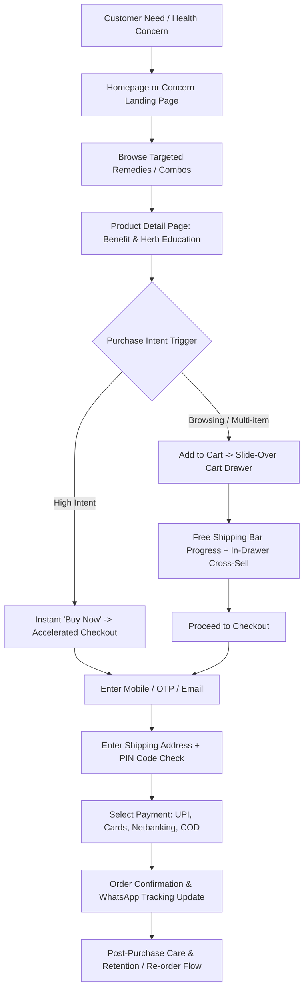

# FIBAX PHARMA — USER FLOWS & CONVERSION ARCHITECTURE
## End-to-End Customer Journeys & High-Converting UX Pathways

---

### 1. Primary Customer Journey (The Intent-to-Conversion Funnel)

---

### 2. High-Intent User Flows

#### Flow 1: "Shop by Concern" Pathway (Organic/Paid Search Landing)
1. **Trigger**: User searches Google for *"ayurvedic remedy for uric acid joint pain"* or clicks a Facebook ad for *Arthobax*.
2. **Landing**: Enters `/concern/joint-pain-relief` or directly onto `/product/arthobax-capsules-for-arthritis-joint-pain-relief`.
3. **PDP Experience**:
   - Above the fold: Product gallery with botanical background, star ratings (4.8★, 64 reviews), strike-through MRP ₹399 -> ₹330 (Save 17%).
   - Pack selector: 1 Bottle (30 caps) | 2 Bottles (Save 10% Extra) | 3-Month Course (Includes Axe Ortho Oil for Free).
   - "Why It Works": Visual breakdown of Sallaki (Boswellia), Guggul, and Nirgundi.
   - Doctor/Vaidya Recommendation Seal.
4. **Action**: User clicks **"Buy Now"**.
5. **Frictionless Transition**: Directly opens the checkout step pre-populated with the bundle offer.

#### Flow 2: Cart Drawer & AOV Booster Pathway
1. **Trigger**: User browses `/shop` and clicks **"Add to Cart"** on *Fibax Triphala Juice 500ml* (₹260).
2. **Cart Drawer Slides Out**:
   - Drawer displays: *"You are ₹739 away from FREE Shipping!"* (Threshold: ₹999).
   - Progress bar at 26%.
3. **In-Cart Recommendation**:
   - Displays smart cross-sell: *"Commonly paired for digestive detox:"* -> *Constisol Syrup (₹199)* and *FP Enzyme Syrup (₹150)*.
4. **1-Click Upsell**:
   - User taps "+ Add" on *Constisol Syrup* right inside the drawer.
   - Cart subtotal updates dynamically to ₹459. Free shipping progress advances to 46%.
5. **Checkout**: User clicks prominent green button: **"Proceed to Checkout • ₹459"**.

#### Flow 3: Mobile Sticky Bottom Bar Interaction
1. **On Mobile Viewports (<768px)**:
   - When a shopper scrolls past the initial CTA on the PDP, a fixed bottom action bar appears smoothly:
     - Left side: Product thumbnail + Current selected pack price (₹330).
     - Right side: Dual buttons:
       - Outline button: **"Add to Cart"** (triggers drawer).
       - Solid gold-green button: **"Buy Now"** (triggers instant checkout).
   - Guarantees 100% CTA visibility across long, informative ingredient and FAQ sections.

---

### 3. Edge Cases & Exception Handling
- **Out of Stock**: Replaces "Add to Cart" with *"Notify Me on WhatsApp"* form; captures phone number and creates a lead in the admin database.
- **Undeliverable PIN Code**: Real-time PIN code validation checks courier serviceable lists (e.g. Shiprocket/Delhivery API). If non-serviceable for COD, prompts user to pay online via Prepaid UPI for standard postal delivery.
- **Abandoned Checkout Recovery**: If a user enters their phone/email during checkout step 1 and drops off before payment, an automated trigger queues a WhatsApp recovery message with an exclusive 5% coupon code after 30 minutes.
